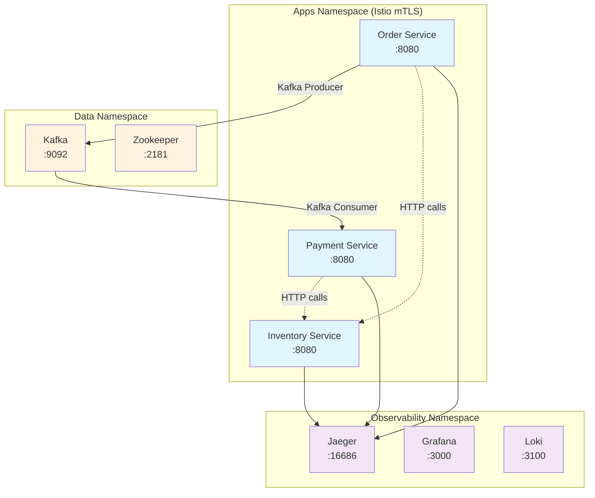

# Quarkus Microservices with Istio Service Mesh

A complete microservices demo showcasing **Quarkus**, **Istio service mesh**, **Kafka messaging**, and **observability** with distributed tracing, logging, and metrics.

## 🏗️ Architecture

This demo implements a simple order processing system with three microservices:



### Services Overview

| Service | Port | Description | Technology |
|---------|------|-------------|------------|
| **Inventory Service** | 8080 | Manages product inventory | Quarkus + REST |
| **Order Service** | 8080 | Processes orders, publishes to Kafka | Quarkus + Kafka Producer |
| **Payment Service** | 8080 | Processes payments from Kafka orders | Quarkus + Kafka Consumer |

### Infrastructure Components

| Component | Port | Purpose |
|-----------|------|---------|
| **Kafka** | 9092 | Message streaming between services |
| **Zookeeper** | 2181 | Kafka cluster coordination |
| **Jaeger** | 16686 | Distributed tracing UI |
| **Grafana** | 3000 | Observability dashboards |
| **Loki** | 3100 | Log aggregation |

## 🚀 Quick Start

### Prerequisites

- **Docker** and **kubectl** installed
- **k3d** for local Kubernetes cluster - [Installation Guide](https://k3d.io/)
- **Istio CLI** (`istioctl`) - [Installation Guide](https://istio.io/latest/docs/setup/getting-started/#download)

### 1. Create k3d Cluster with Registry

```bash
# Use the automated setup script
./scripts/setup-k3d.sh
```

**What this does:**
- ✅ Checks for k3d installation
- ✅ Creates local Docker registry at `registry.localhost:5001`
- ✅ Creates k3d cluster `quarkus-mesh` with 2 agents
- ✅ Configures registry integration
- ✅ Disables Traefik (we'll use Istio instead)
- ✅ Waits for cluster to be ready

**Manual alternative:**
```bash
# If you prefer manual setup
k3d registry create registry.localhost --port 0.0.0.0:5001
k3d cluster create quarkus-mesh \
  --agents 2 \
  --registry-use registry.localhost:5001 \
  --k3s-arg "--disable=traefik@server:0" \
  --wait
```

### 2. Deploy Infrastructure

```bash
# Deploy Istio, Kafka, and observability stack
./scripts/deploy-infra.sh
```

**What this does:**
- ✅ Creates namespaces with Istio injection
- ✅ Installs Istio with demo profile
- ✅ Configures mTLS policies (strict for apps, disabled for Kafka)
- ✅ Deploys Kafka + Zookeeper with Istio sidecars
- ✅ Sets up Jaeger, Grafana, and Loki

### 3. Build and Deploy Applications

```bash
# Build container images and deploy to k3d
./scripts/build-and-deploy.sh
```

**What this does:**
- ✅ Cleans and builds Quarkus applications
- ✅ Pushes images to local k3d registry
- ✅ Deploys services to Kubernetes with Istio sidecars
- ✅ Waits for all rollouts to complete

### 4. Verify Deployment

```bash
# Check all pods are running
kubectl get pods -A

# Should show all services as 2/2 Running (app + istio-proxy)
kubectl get pods -n apps
```

Expected output:
```
NAME                                 READY   STATUS    RESTARTS   AGE
inventory-service-86c4c47595-l7qzw   2/2     Running   0          5m
order-service-5cb4479b95-snbtj       2/2     Running   0          5m
payment-service-d68b8d7b6-xd2pz      2/2     Running   0          5m
```

## 🔗 Access Applications

### Port Forwarding

```bash
# Access services locally
kubectl port-forward -n apps svc/inventory-service 8080:8080
kubectl port-forward -n apps svc/order-service 8081:8080  
kubectl port-forward -n apps svc/payment-service 8082:8080

# Access observability
kubectl port-forward -n observability svc/jaeger 16686:16686
kubectl port-forward -n observability svc/grafana 3000:3000
```

### Service URLs

| Service | Local URL | Description |
|---------|-----------|-------------|
| Inventory Service | http://localhost:8080 | Product inventory API |
| Order Service | http://localhost:8081 | Order processing API |  
| Payment Service | http://localhost:8082 | Payment processing API |
| Jaeger UI | http://localhost:16686 | Distributed tracing |
| Grafana | http://localhost:3000 | Metrics dashboards |

### Health Checks

```bash
# Check service health
curl http://localhost:8080/q/health
curl http://localhost:8081/q/health  
curl http://localhost:8082/q/health
```

## 📊 Testing the System

### 1. Create an Order

```bash
# Create a new order (triggers Kafka flow)
curl -X POST http://localhost:8081/orders \
  -H "Content-Type: application/json" \
  -d '{
    "customerId": "customer-123",
    "productId": "product-456", 
    "quantity": 2,
    "price": 29.99
  }'
```

### 2. Check Inventory

```bash
# Check product inventory
curl http://localhost:8080/inventory/product-456
```

### 3. View Traces in Jaeger

1. Open http://localhost:16686
2. Select `order-service` from dropdown
3. Click **Find Traces**
4. View end-to-end trace including Kafka messaging

### 4. Monitor Logs

```bash
# Watch order processing logs
kubectl logs -f -n apps deployment/order-service -c order-service

# Watch payment processing logs  
kubectl logs -f -n apps deployment/payment-service -c payment-service
```

## 🔧 Configuration Details

### Istio Service Mesh

The demo uses **Istio** for service mesh capabilities:

- **mTLS**: Strict between application services
- **Traffic Management**: Load balancing and circuit breaking
- **Observability**: Automatic trace generation
- **Security**: Network policies and authentication

### Kafka Configuration

**Kafka Setup:**
- **Protocol**: Plaintext (internal)
- **Istio mTLS**: Disabled for Kafka to allow plaintext communication
- **Topics**: Auto-created when first used
- **Partitions**: Single partition for demo simplicity

**Message Flow:**
```
Order Service → orders topic → Payment Service
```

### Observability Stack

**Distributed Tracing (Jaeger):**
- Automatic span creation via Quarkus OpenTelemetry
- Cross-service trace correlation
- Kafka message tracing

**Logging (Loki):**
- Structured JSON logs from all services  
- Centralized log aggregation
- Grafana integration for log exploration

**Metrics (Prometheus/Grafana):**
- Application metrics via Micrometer
- Istio service mesh metrics
- Business metrics (orders, payments, etc.)

## 🏗️ Project Structure

```
├── README.md
├── scripts/
│   ├── setup-k3d.sh            # Create k3d cluster with registry
│   ├── deploy-infra.sh          # Deploy infrastructure
│   └── build-and-deploy.sh      # Build and deploy apps
├── inventory-service/           # Product inventory microservice
├── order-service/              # Order processing microservice  
├── payment-service/            # Payment processing microservice
└── k8s/
    ├── namespaces.yaml         # Kubernetes namespaces
    ├── apps/                   # Application deployments
    ├── istio/                  # Istio configuration
    │   ├── peer-auth-strict.yaml
    │   ├── destination-rules.yaml
    │   └── kafka-mtls-policy.yaml
    ├── kafka/                  # Kafka deployment
    ├── jaeger/                 # Jaeger tracing
    ├── loki/                   # Loki logging
    └── grafana/                # Grafana dashboards
```

## 🐛 Troubleshooting

### Common Issues

**1. Pods stuck in ImagePullBackOff**
```bash
# Check registry connectivity
docker exec k3d-quarkus-mesh-agent-0 sh -c "wget -q -O - http://k3d-registry.localhost:5000/v2/_catalog"

# Rebuild and push images
./scripts/build-and-deploy.sh
```

**2. Services not ready (1/2 Running)**
```bash
# Check Kafka connectivity
kubectl logs -n apps deployment/order-service -c order-service --tail=20

# Verify Kafka is running with Istio sidecar
kubectl get pods -n data -o wide
# Should show 2/2 Running for kafka and zookeeper
```

**3. Istio sidecar not injected**
```bash  
# Check namespace labels
kubectl get namespace -l istio-injection=enabled

# Re-label and restart if needed
kubectl label namespace apps istio-injection=enabled --overwrite
kubectl rollout restart deployment/order-service -n apps
```

**4. mTLS communication issues**
```bash
# Check Istio policies
kubectl get peerauthentication -A
kubectl get destinationrule -A

# View Istio proxy logs
kubectl logs -n apps deployment/order-service -c istio-proxy
```

### Debug Commands

```bash
# Check all resources
kubectl get all -A

# Describe problematic pods
kubectl describe pod -n apps <pod-name>

# Check Istio configuration
istioctl proxy-config cluster -n apps <pod-name>

# View service mesh traffic
istioctl dashboard kiali
```

### Clean Up

```bash
# Delete k3d cluster (removes everything)
k3d cluster delete quarkus-mesh

# Or delete just the applications
kubectl delete namespace apps data observability
```

## 🔒 Security Features

### Istio mTLS

- **Apps ↔ Apps**: Strict mTLS enforced
- **Apps ↔ Kafka**: Plaintext (via Istio proxy)
- **Kafka ↔ Zookeeper**: Plaintext (disabled mTLS)

### Network Policies

- Services isolated by namespace
- Only necessary ports exposed
- Istio proxy handles all ingress/egress

## 📈 Monitoring & Observability

### Metrics Available

- **Application**: Request rates, response times, error rates
- **Business**: Orders created, payments processed, inventory levels
- **Infrastructure**: Pod CPU/memory, Kafka throughput
- **Istio**: Service mesh traffic, mTLS success rates

### Tracing Features

- **End-to-end traces** across all services
- **Kafka message correlation** between producers/consumers
- **Database operation spans** (if applicable)
- **HTTP call correlation** between services

### Log Correlation

- **Trace ID injection** in all log entries
- **Structured JSON** logging format
- **Centralized aggregation** via Loki
- **Grafana exploration** with filtering

## 🚧 Next Steps

### Potential Enhancements

1. **Database Integration**: Add PostgreSQL with connection pooling
2. **Advanced Kafka**: Multiple partitions, consumer groups, dead letter queues
3. **Security**: RBAC, OAuth2, certificate management
4. **Performance**: HPA, resource limits, JVM tuning
5. **Resilience**: Circuit breakers, retries, bulkheads
6. **GitOps**: ArgoCD integration for deployment automation

### Production Considerations

- **Resource limits** and requests for all containers
- **Persistent volumes** for Kafka and databases  
- **External secrets** management (not hardcoded values)
- **Network policies** for additional security
- **Backup strategies** for data persistence
- **Multi-environment** deployment pipelines

---

## 📝 License

This project is for demonstration purposes. Feel free to use it as a learning resource or starting point for your own microservices architecture.
